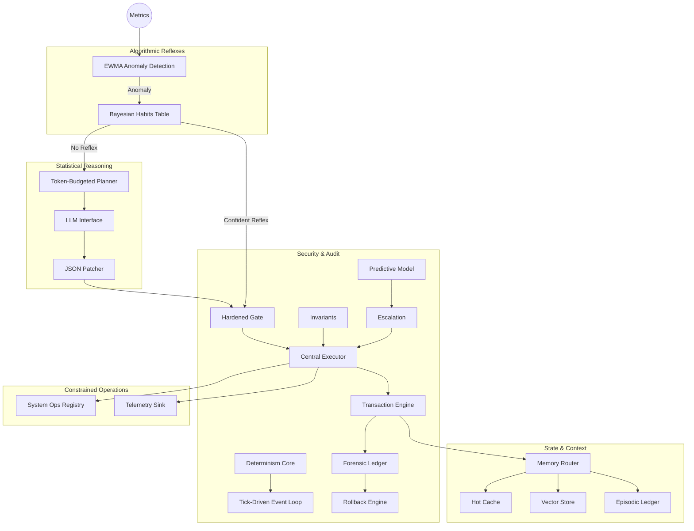

# Dev-bot: Deterministic Autonomous DevOps Agent

[](https://github.com/dawsonblock/Dev-bot/actions)
[](https://www.python.org/downloads/)
[](https://opensource.org/licenses/MIT)

A **bounded, auditable, self-improving autonomous agent** for continuous system maintenance. The LLM is in the passenger seat — the deterministic kernel drives.

---

## ⚡ Core Properties

| Property | Implementation |
|---|---|
| **Non-bypassable Gate** | Every action passes through `kernel/gate.py` with argument regex, rate limits, and reversibility checks |
| **Central Executor** | All tool dispatch flows through `kernel/execute.py` — no direct tool calls anywhere |
| **Cryptographic Ledger** | SHA-256 hash-chained, tamper-evident, forensic-grade with full I/O capture |
| **Transactional Rollback** | `kernel/txn.py` provides begin/commit/abort with state snapshot restore |
| **Deterministic Replay** | Tick-driven clock, global seed, deterministic retrieval — replay reproduces decisions |
| **Formal Invariants** | State invariants validated before every transaction commit |
| **Confidence-bounded Learning** | Beta posterior habits with Wilson score — reflexes fire only with statistical evidence |
| **Predictive Failure Model** | Rolling window risk scoring triggers pre-emptive safe mode |
| **Escalation Ladder** | Failure taxonomy with deterministic mode transitions |

---

## 🏗️ Architecture



### Timescales

| Tier | Interval | Work |
|---|---|---|
| **Fast** | Every tick | Metric ingest, EWMA update, hot cache write |
| **Medium** | 10 ticks | Anomaly scoring, Bayesian habit lookup |
| **Slow** | 30 ticks | LLM planning (or reflex bypass), gated execution |

---

## 🔒 Security Model

- **No freeform shell** — `tools/shell.py` replaced with `tools/system_ops.py` (allowlisted commands only)
- **Argument validation** — regex-enforced per tool in `policy.yaml`
- **Rate limiting** — per-tool rate ceilings enforced by the gate
- **Reversibility classification** — `reversible`, `compensatable`, `irreversible`
- **Repeat-failure guard** — consecutive failures block tool re-execution
- **Code integrity** — `kernel/integrity.py` fingerprints codebase at boot
- **Policy validation** — `kernel/policy_schema.py` rejects malformed configs at startup
- **Capability tokens** — `kernel/capabilities.py` provides cryptographic scoped permissions

---

## 🚀 Quick Start

```bash
# Install dependencies
pip install -r requirements.txt

# Run with stub LLM (no API key needed)
cd agent
python run.py

# Run with real Claude API
ANTHROPIC_API_KEY=sk-... python run.py --llm api

# Run with local Ollama
python run.py --llm ollama

# Verify ledger integrity
python -c "from kernel.ledger import Ledger; ok,n = Ledger.verify('ledger.jsonl'); print('PASS' if ok else 'FAIL')"
```

### Environment Variables

| Variable | Default | Purpose |
|---|---|---|
| `PROMETHEUS_URL` | `http://localhost:9090` | Prometheus server for live metrics |
| `ANTHROPIC_API_KEY` | — | Claude API key (if `--llm api`) |

---

## 📁 Module Map

```
agent/
├── kernel/                    # Security & Audit Core
│   ├── determinism.py         # Global seed, tick clock, config hash
│   ├── event_loop.py          # Tick-driven main loop
│   ├── gate.py                # Hardened policy gate with arg validation
│   ├── execute.py             # Central non-bypassable executor
│   ├── txn.py                 # Transaction engine (begin/commit/abort)
│   ├── ledger.py              # Forensic SHA-256 hash-chained log
│   ├── rollback.py            # Deep-copy snapshot stack
│   ├── watchdog.py            # Stall detection + auto-rollback
│   ├── statehash.py           # Canonical state fingerprinting
│   ├── integrity.py           # Code + config integrity hashing
│   ├── policy_schema.py       # Startup config validation
│   ├── invariants.py          # Formal state invariant rules
│   ├── capabilities.py        # Cryptographic capability tokens
│   ├── execution_graph.py     # Phase transition validator
│   ├── escalation.py          # Failure taxonomy + safe mode
│   ├── predictive.py          # Rolling risk score model
│   └── replay.py              # Dry replay engine
├── sparse/                    # Algorithmic Reflexes
│   ├── anomaly.py             # EWMA with dynamic variance
│   └── habits.py              # Beta posterior confidence bounds
├── dense/                     # Statistical Reasoning
│   ├── llm_iface.py           # Swappable LLM backend
│   ├── planner.py             # Token-budgeted proposal generator
│   └── patcher.py             # Plan → structured action dict
├── memory/                    # State & Context
│   ├── hot_cache.py           # Bounded FIFO context buffer
│   ├── vector_store.py        # Deterministic BM25 retrieval
│   ├── episodic_ledger.py     # Queryable (ctx, action, outcome) history
│   ├── archive.py             # gzip cold snapshots
│   └── router.py              # Unified memory router with txn staging
├── tools/                     # Constrained Operations
│   ├── system_ops.py          # Allowlisted tool registry (no shell)
│   ├── metrics.py             # Prometheus live metric ingestion
│   └── telemetry.py           # Structured JSONL metrics sink
├── scheduler/                 # Tick-Based Scheduling
│   ├── clocks.py              # Three-tier tick-based due tracker
│   └── budgets.py             # Token + call rate limiter (tick refill)
├── config/
│   ├── policy.yaml            # Full policy schema with arg constraints
│   └── budgets.yaml           # Rate limits, thresholds, determinism seed
├── tests/
│   └── replay_tests.py        # Ledger hash chain verification
└── run.py                     # Hardened main runner
```

---

## 🛠️ Adding a New Tool

1. Add an entry to `config/policy.yaml` with `allowed`, `max_risk`, `reversibility`, `args`
2. Create a tool class in `tools/system_ops.py` with a `run(args)` method
3. Register it in `TOOL_REGISTRY`
4. Add the keyword to `ACTION_REGISTRY` in `dense/patcher.py`

The gate automatically enforces the new policy. The executor automatically wraps it in transactions and logs it forensically.
