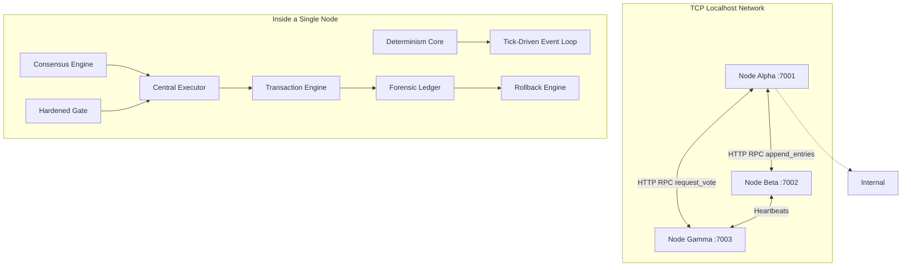

# Dev-bot: Distributed Deterministic Autonomous DevOps Agent

[](https://github.com/dawsonblock/Dev-bot/actions)
[](https://www.python.org/downloads/)
[](https://opensource.org/licenses/MIT)

A **bounded, auditable, self-improving autonomous agent** for continuous system maintenance. The LLM is in the passenger seat — the deterministic kernel, now fortified with **Raft-based Distributed Consensus**, drives the system.

---

## ⚡ Core Properties

| Property | Implementation |
|---|---|
| **Distributed Consensus (Raft)** | `kernel/consensus.py` coordinates multi-node leader election and log replication (`append_entries`, `request_vote`) over true HTTP RPC. |
| **Multiprocessing Cluster** | `demo_cluster.py` simulates a real distributed environment using OS-level process isolation and cross-process TCP networking. |
| **Non-bypassable Gate** | Every action passes through `kernel/gate.py` with argument regex, rate limits, and reversibility checks. |
| **Central Executor** | All tool dispatch flows through `kernel/execute.py` — no direct LLM tool calls anywhere. |
| **Cryptographic Ledger** | SHA-256 hash-chained, tamper-evident, forensic-grade ledger log with full I/O capture. |
| **Transactional Rollback** | `kernel/txn.py` provides begin/commit/abort with deep state snapshot restores. |
| **Deterministic Replay** | Tick-driven clock, global seed, deterministic BM25 retrieval — replay perfectly reproduces decisions. |
| **Formal Invariants** | State invariants validated before every transaction commit. |
| **Predictive Failure Model** | Rolling window risk scoring triggers pre-emptive safe mode & escalation. |

---

## 🏗️ Architecture Stack

### The Distributed Agent Topology

Dev-bot operates as a decentralized network of autonomous nodes. Any active node can be elected leader and coordinate platform maintenance.



### Cognitive Timescales

| Tier | Interval | Work |
|---|---|---|
| **Micro (Network)** | `< 500ms` | Raft RPCs (`/heartbeat`, `/request_vote`, `/append_entries`), consensus jitter |
| **Fast (Reflex)** | Every tick | Metric ingest, EWMA anomaly update, hot cache write |
| **Medium (Habit)** | 10 ticks | Anomaly scoring, Bayesian habit lookup |
| **Slow (Thought)**| 30 ticks | LLM planning (if reflexes bypassed), gated slow-execution |

---

## 🔒 Security & Verification Model

Dev-bot employs a fundamentally defensive stance against both internal LLM hallucinations and external environmental anomalies.

- **Consensus-Gated Ledger** — Application state (`DistributedLedger`) requires multi-node quorum approval before mutation.
- **HMAC Signatures** — Every ledger entry (`verified_record.py`) is signed with a cryptographic secret; tampered logs fail boot verification.
- **No Freeform Shell** — `tools/shell.py` has been deprecated in favor of `tools/system_ops.py` (allowlisted exact-match commands).
- **Execution Containment** — Execution is firewalled through the strictly typed `gate.py`.
- **Code Integrity** — `kernel/integrity.py` hashes the codebase at boot to prevent self-modification drift.

---

## 📊 Observability & UI

Dev-bot provides a rich, real-time observability suite separated entirely from the agent's core decision loop to prevent observer effects.

- **SSE Dashboard (`tools/dashboard.py`)**: A purely HTTP-based Server-Sent Events backend broadcasting live agent state.
- **Vite Web UI (`ui/index.html`)**: A decoupled, reactive frontend displaying live Raft terms, commit indices, anomaly graphs, and gate rejections.

---

## 🚀 Quick Start

```bash
# Install dependencies
pip install -r requirements.txt

# Start the Web UI (Frontend)
cd ui
npm install
npm run dev

# In a new terminal, run the distributed cluster (Backend)
cd agent
python demo_cluster.py
```

### Environment Config (`.env`)

| Variable | Default | Purpose |
|---|---|---|
| `PROMETHEUS_URL` | `http://localhost:9090` | Prometheus server for live hardware metrics |
| `ANTHROPIC_API_KEY` | *(Required for full LLM)* | Claude API key |
| `NETWORK_RPC_TIMEOUT` | `0.5` | Timeout for Raft HTTP peer polling |

---

## 📁 Repository Structure

```
Dev-bot/
├── agent/
│   ├── kernel/                    # System Call & Distributed Core
│   │   ├── consensus.py           # Raft leader election & log sync
│   │   ├── network_rpc.py         # HTTP Server/Client for Inter-node RPC
│   │   ├── distributed_ledger.py  # Quorum-gated state storage
│   │   ├── gate.py                # Hardened policy gate
│   │   ├── verified_record.py     # HMAC payload signatures
│   │   ├── txn.py                 # Acid-compliant state rollbacks
│   │   └── replay.py              # Cryptographic log replayer
│   ├── dense/                     # Statistical Reasoning (LLM)
│   │   └── llm_iface.py           # Swappable OpenAI/Anthropic/Ollama backend
│   ├── sparse/                    # Fast Algorithmic Reflexes
│   │   ├── anomaly.py             # EWMA with dynamic variance
│   │   └── habits.py              # Bayesian posterior confidence tables
│   ├── memory/                    # Context Vector Databases
│   │   └── vector_store.py        # Deterministic BM25 retrieval
│   ├── tools/                     # Constrained Operands
│   │   └── dashboard.py           # Real-time SSE telemetry exporter
│   ├── demo_cluster.py            # Multiprocessing 3-node runner
│   └── tests/                     # Validation Suite
│       └── test_full_loop.py      # E2E multi-node ledger + consensus test
├── ui/                            # Observability Frontend
│   └── index.html                 # Modern SSE Consumer Dashboard
└── config/
    └── policy.yaml                # Hardcoded Gate Rule Allowlist
```
