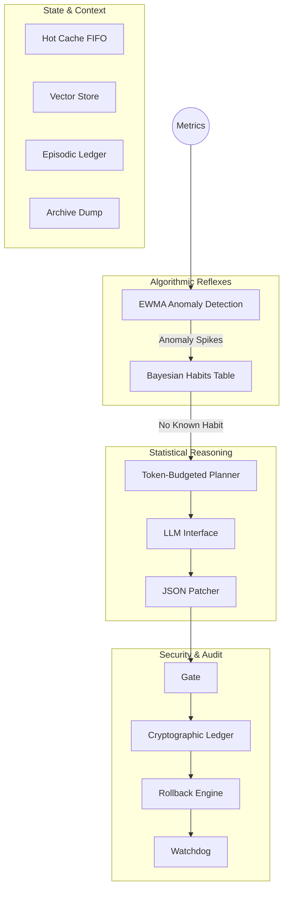

# Dev-bot: Deterministic Autonomous DevOps Agent

[](https://opensource.org/licenses/MIT)
[](https://www.python.org/downloads/)

Dev-bot is a bounded, auditable, and self-improving autonomous agent designed for continuous system maintenance. It fundamentally shifts the LLM away from the "steering wheel" and places it in the "passenger seat." The agent operates as a deterministic state machine equipped with cryptographic logging and transactional rollback, consulting an LLM solely as an interchangeable heuristic function during slow timescales, securely sandboxed by static configuration limits.

---

## ⚡ Core Properties

* **Non-bypassable Policy Gate:** Every action passes through `kernel/gate.py` before execution.
* **Append-only Cryptographic Ledger:** SHA-256 hash-chained, tamper-evident action log (`ledger.jsonl`).
* **Deterministic Replay:** The ledger can be cryptographically replayed and verified offline.
* **Online Learning within Envelopes:** A Bayesian "Habit" table tracks tool success rates, allowing the agent to "compile" dense LLM reasoning down into fast, sparse reflexes.
* **Automatic Rollback:** Deep-copy snapshot stack auto-restores state on failure.
* **Multi-timescale Scheduler:** Reflexive vs. deliberate thought loops (Fast 0.5s, Medium 5s, Slow 15s).

---

## 🏗️ Architecture

The system cleanly divides logical operations into Security (Kernel), fast algorithmic reflexes (Sparse), and statistical contextual reasoning (Dense).



### Timescales

1. **Fast (0.5s)**: Ingests telemetry, updates EWMA variance models, saves context to hot caches.
2. **Medium (5s)**: If an anomaly is active, consults the Bayesian Habits table. If a known-good reflex exists (> 0.6 success rate), it bypasses the LLM entirely and executes.
3. **Slow (15s)**: If no reflex covers the anomaly, delegates to the Token-Budgeted Planner to query the LLM (Stub, Anthropic, or local Ollama) for a contextual fix.

---

## 🔌 Real World Integrations

Dev-bot ships with fully functional, real-world execution systems rather than stubs:

* **Prometheus Metrics (`tools/metrics.py`)**: Ingests live HTTP 5xx error rates and p99 latency histograms over a 1m rolling window via PromQL.
* **System Execution (`run.py` -> `tools/shell.py`)**: Dispatches OS-level commands (e.g., `sudo systemctl restart`, `curl -f -s`) natively matching its policy envelope.
* **Pytest CI (`tools/ci.py`)**: Runs physical local Python subprocesses to verify system integrity before sealing an execution.

---

## 🚀 Quick Start

### 1. Install Dependencies

```bash
pip install pyyaml requests
```

### 2. Run the Agent

**Run with stub LLM (no API key needed):**

```bash
cd agent
python run.py
```

**Run with real Claude API:**

```bash
export ANTHROPIC_API_KEY=sk-...
python run.py --llm anthropic
```

**Run with local Ollama:**

```bash
python run.py --llm ollama
```

### 3. Verification & Testing

Run all tests (in a separate shell while agent is running, or standalone):

```bash
python tests/replay_tests.py
```

Verify ledger cryptographic integrity:

```bash
python -c "from kernel.ledger import Ledger; ok,n = Ledger.verify('ledger.jsonl'); print('PASS' if ok else 'FAIL')"
```

---

## 🛠️ Adding a New Tool

Extending the agent's capabilities is straightforward and secure by default:

1. Add an entry to `config/policy.yaml` with `max_risk` and `requires_approval`.
2. Add the tool keyword to `ACTION_REGISTRY` in `dense/patcher.py`.
3. Implement the tool function logic in `tools/`.
4. Dispatch it in the `execute()` function in `run.py`.

The Kernel Gate automatically enforces the new policy rule—no other safety changes required.
